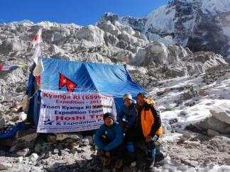
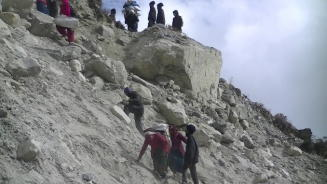
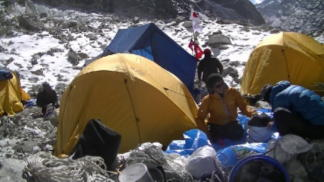
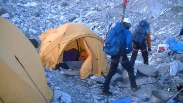
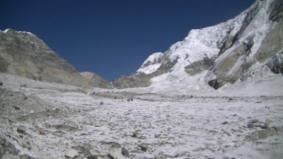
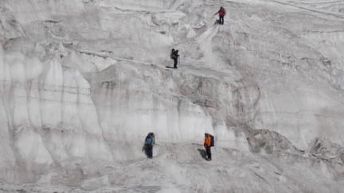
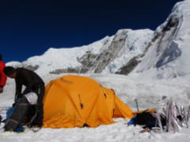
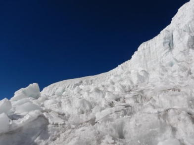

**未踏峰・キュンカ・リ　「6578ｍ」**

**11月8日～12月10日**
**会創立3年記念行事でランタンヒマール**
**未踏峰「キュンカ・リ」に挑んだが**
**地震・温暖化の影響か氷河の後退や落雪で**
**シャルバチュム氷河とキュンカ・リは岩と氷の世界でした**
**スノーバーは使えず5650ｍで断念。**

 

  

<td>  

  

  

  

  

  

  
