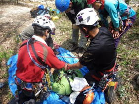
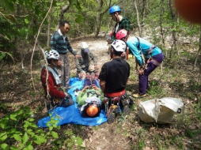
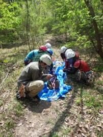
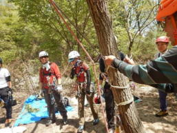
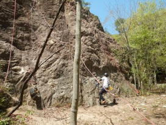
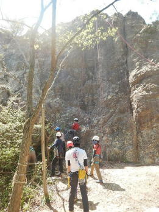

21・22日：レスキューコンポ訓練
安全確保技術の確立

</td>
</td>

</td>

仲間は仲間で助けるを基本としています。
搬送技術は山岳会の最低条件で
負傷者の頸椎保護
打撲、傷等による体温低下の保温維持
コンポの重要性等を毎年繰り返し訓練
実施しています。

まず登る技術より、確保技術を重点に実施しています。
３０Ｋのタイヤを落下率80ｍで
足場の悪い所で安全な確保ができるのか?
男性、女性とも安全確保が不十分だった。
特に女性は不可能に近い。

ゲレンデでは、訓練のための訓練ではなく、
本場を想定しての訓練を重ね安全登攀を
目指して行きます。
